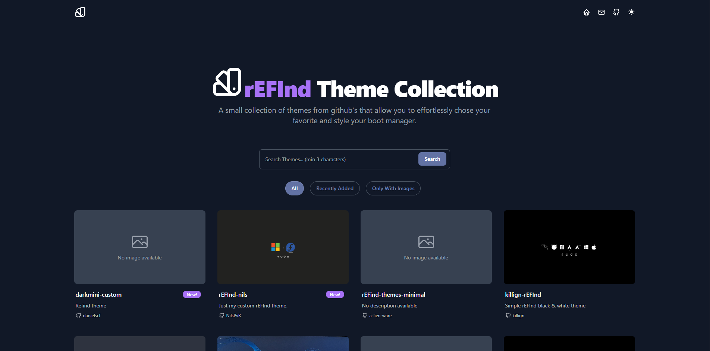

# rEFInd Themes Collection 🎨

A curated collection of clean, minimalist and colorful themes for the [rEFInd boot manager](https://www.rodsbooks.com/refind/).  
Preview themes live, browse screenshots, and get direct links to GitHub repositories.

🔗 **Website:** [refind-themes-collection.netlify.app](https://refind-themes-collection.netlify.app)

## 📌 About

[rEFInd](https://www.rodsbooks.com/refind/) is a versatile UEFI boot manager that supports custom themes to personalize your boot experience.  
This project showcases a handpicked collection of rEFInd themes for users looking to enhance the look and feel of their boot menus.

Whether you prefer dark, light, colorful or minimalist themes — this site gives you an easy way to explore and download them.

## 🚀 Features

- 🌐 One-page gallery with fast preview
- 📷 Full screenshots of each theme
- 🔗 Direct links to source repositories
- 📱 Mobile-friendly layout

## 🎥 Featured on YouTube

This project was mentioned in the video:  
▶️ **[4053 REFIND – 6 Themes to Choose From](https://www.youtube.com/watch?v=IvPUX0MFqqg)** by Arco Linux.

> The author explores different rEFInd themes and mentions this collection as a reference resource.

## 🤝 Submit Your Theme

Want to share your own rEFInd theme with the community?  
Feel free to open a [pull request](https://github.com/martinmilani/rEFInd-theme-collection/pulls) or [create an issue](https://github.com/martinmilani/rEFInd-theme-collection/issues) with a link to your repository.

Your work will be reviewed and, if accepted, added to the gallery with credit.

## 📄 License

This project is licensed under the [MIT License](https://opensource.org/licenses/MIT).

You are free to use, modify or share the code and website content. Attribution is appreciated.  
If you use or reference this collection, please consider linking back to the site:

## 🧞 Commands

All commands are run from the root of the project, from a terminal:

| Command                    | Action                                           |
| :------------------------- | :----------------------------------------------- |
| `pnpm install`             | Installs dependencies                            |
| `pnpm run dev`             | Starts local dev server at `localhost:4321`      |
| `pnpm run build`           | Build your production site to `./dist/`          |
| `pnpm run preview`         | Preview your build locally, before deploying     |
| `pnpm run astro ...`       | Run CLI commands like `astro add`, `astro check` |
| `pnpm run astro -- --help` | Get help using the Astro CLI                     |
