# rEFInd Themes Collection
### A small collection of refind themes from github's that allow you to effortlessly chose your favorite and style your linux boot manager.

## Themes
| Name | Description | User | Multiple Backgrounds | Image |
|------|-------------|------|----------------------|-------|
| [rEFInd-minimal](https://github.com/evanpurkhiser/rEFInd-minimal) | A stunningly clean theme for the rEFInd UEFI boot manager. | [evanpurkhiser](https://github.com/evanpurkhiser)  | false |   |
| [rEFInd-theme-Regular](https://github.com/bobafetthotmail/refind-theme-regular) | A simplistic clean and minimal theme for rEFInd | [bobafetthotmail](https://github.com/bobafetthotmail)  | true |  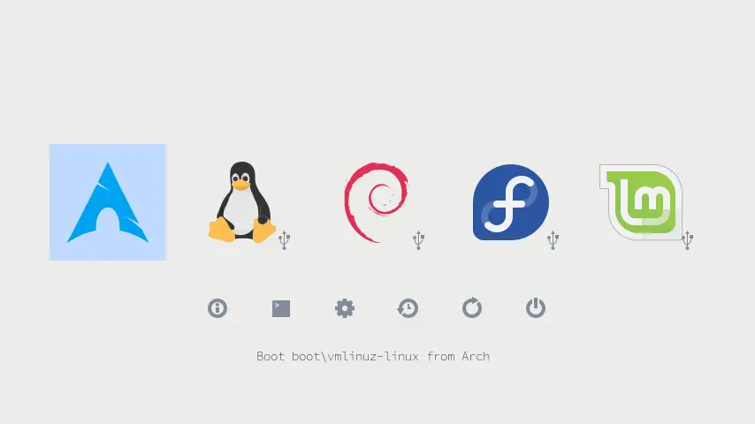 |
| [refind-ambience](https://github.com/lukechilds/refind-ambience) | Minimal theme for the rEFInd boot manager | [lukechilds](https://github.com/lukechilds)  | false |   |
| [ursamajor-rEFInd](https://github.com/kgoettler/ursamajor-rEFInd) | Ursa Major theme for rEFInd Bootloader | [kgoettler](https://github.com/kgoettler)  | false |   |
| [rEFInd-glassy](https://github.com/Pr0cella/rEFInd-glassy) | A minimalistic rEFInd theme | [Pr0cella](https://github.com/Pr0cella)  | false |   |
| [darkmini](https://github.com/LightAir/darkmini) | Dark theme for rEFInd | [LightAir](https://github.com/LightAir)  | true |   |
| [Matrix-rEFInd](https://github.com/Yannis4444/Matrix-rEFInd) | A rEFInd theme based on the scene from the movie Matrix where Morpheus offers the two pills to Neo | [Yannis4444](https://github.com/Yannis4444)  | false |   |
| [refind2k](https://github.com/2KAbhishek/refind2k) | A minimalist dark theme for rEFInd. 💠💻 | [2KAbhishek](https://github.com/2KAbhishek)  | true |   |
| [rEFInd-minimal-themes](https://github.com/quantrancse/rEFInd-minimal-themes) | Minimalist themes for the rEFInd UEFI boot manager. | [quantrancse](https://github.com/quantrancse)  | true |   |
| [refind-theme-dark](https://github.com/samuelmeuli/refind-theme-dark) | 🎨 A simple, dark theme for rEFInd | [samuelmeuli](https://github.com/samuelmeuli)  | false |   |
| [refind](https://github.com/catppuccin/refind) | 🔄 Soothing pastel theme for rEFInd | [catppuccin](https://github.com/catppuccin)  | false |  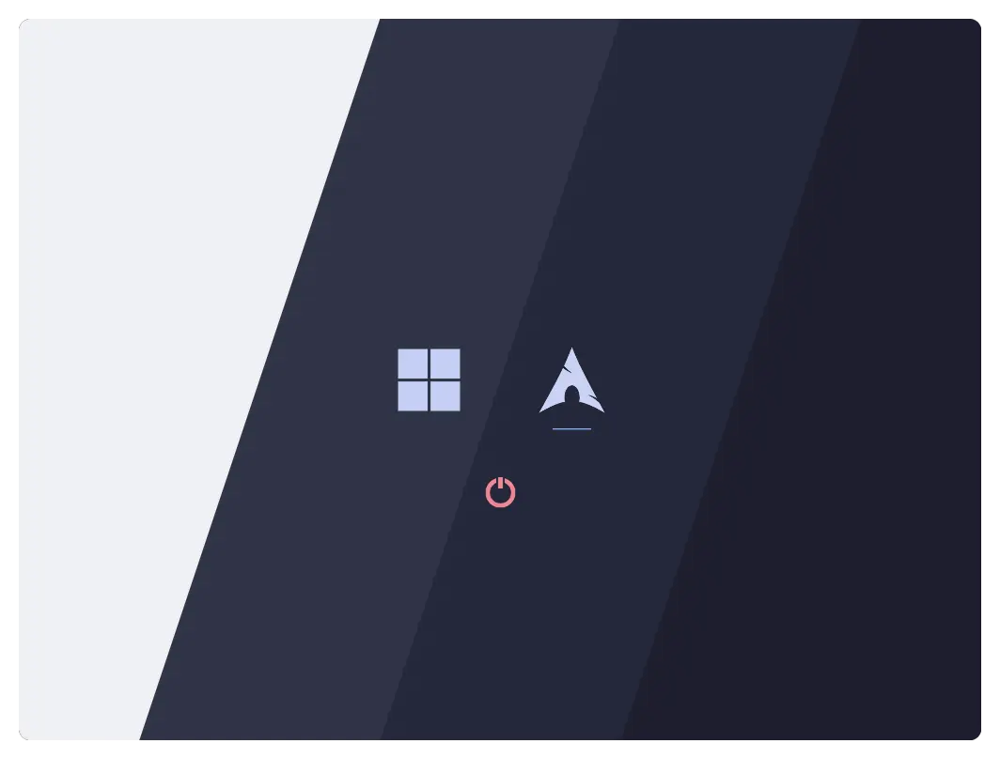 |
| [rEFInd-chalkboard](https://github.com/AliciaTransmuted/rEFInd-chalkboard) | A simple monochrome theme for the rEFInd UEFI boot manager | [AliciaTransmuted](https://github.com/AliciaTransmuted)  | false |  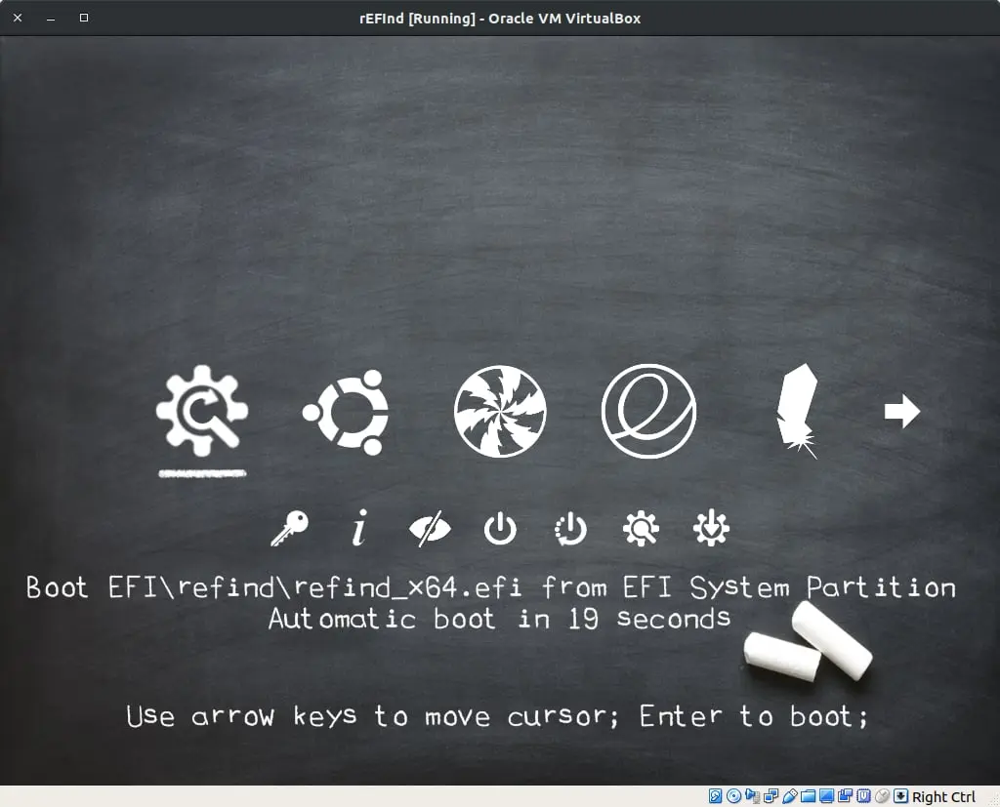 |
| [dm](https://github.com/mustaqimM/dm) | dm. A theme for rEFInd. | [mustaqimM](https://github.com/mustaqimM)  | false |   |
| [refind-efifetch](https://github.com/bushtail/refind-efifetch) | neofetch theme for the rEFInd boot manager | [bushtail](https://github.com/bushtail)  | false |   |
| [refind-theme-nord](https://github.com/jaltuna/refind-theme-nord) | rEFInd theme inspired by the Nord palette | [jaltuna](https://github.com/jaltuna)  | false |   |
| [rEFInd-theme](https://github.com/hashhar/rEFInd-theme) | A boot manager theme for rEFInd | [hashhar](https://github.com/hashhar)  | true |   |
| [refind-bsd-black](https://github.com/indgy/refind-bsd-black) | A black rEFInd BSD icon theme for DragonFlyBSD, FreeBSD, GhostBSD, MidnightBSD, NetBSD, NomadBSD and OpenBSD. | [indgy](https://github.com/indgy)  | false |   |
| [refind-theme-elementary](https://github.com/danirabbit/refind-theme-elementary) | an elementary theme for rEFInd | [danirabbit](https://github.com/danirabbit)  | false |   |
| [rEFInd-minimal-modded](https://github.com/AdityaGarg8/rEFInd-minimal-modded) | Minimal rEFInd theme. | [AdityaGarg8](https://github.com/AdityaGarg8)  | false |  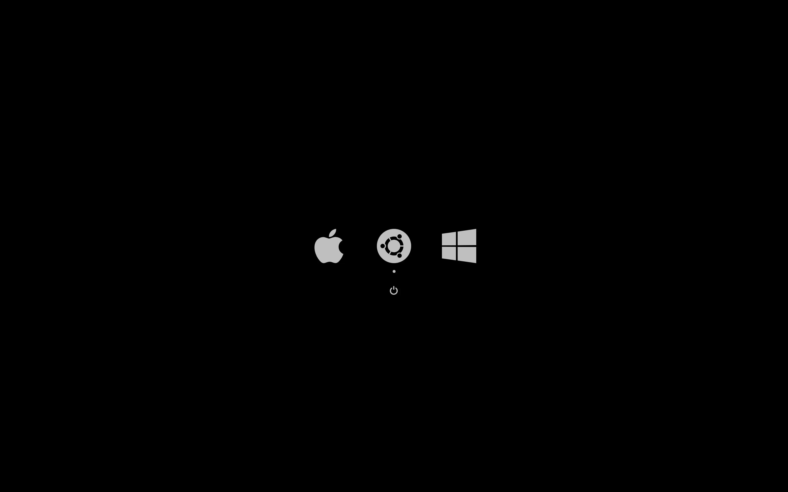 |
| [rEFInd-indulgence](https://github.com/AliciaTransmuted/rEFInd-indulgence) | rEFInd-indulgence is a luxurious soft leather icon theme with a custom hand stitched font for the rEFInd UEFI boot manager | [AliciaTransmuted](https://github.com/AliciaTransmuted)  | false |   |
| [rEFInd-minimal-drunkcj](https://github.com/drunckj/rEFInd-minimal-drunkcj) | rEFInd is an easy to use boot manager for UEFI based systems. This is a clean and minimal theme for it. | [drunckj](https://github.com/drunckj)  | false |  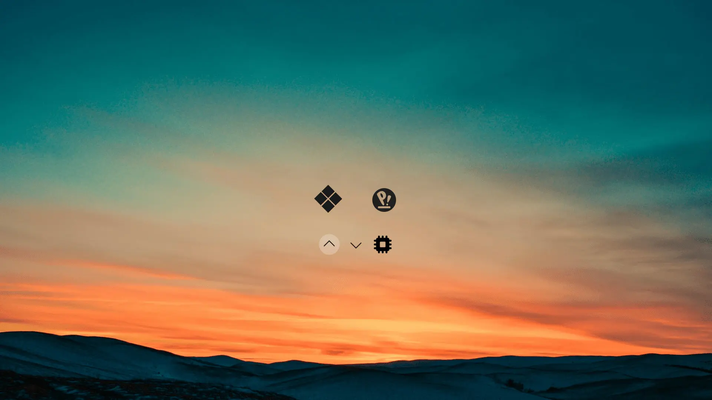 |
| [Refind-Maia-Reskin](https://github.com/Fantailed/Refind-Maia-Reskin) | My take on the Refind Maia theme. | [Fantailed](https://github.com/Fantailed)  | false |  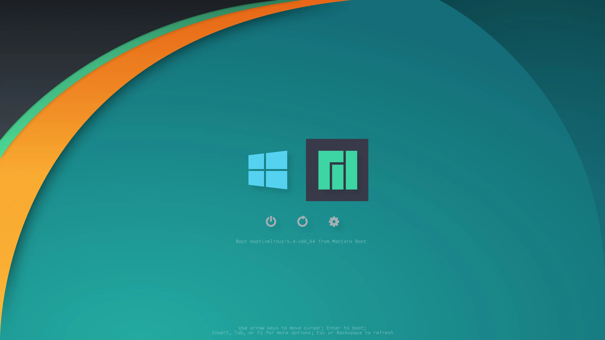 |
| [glow](https://github.com/antsif-a/glow) | Glow theme for the rEFInd boot manager | [antsif-a](https://github.com/antsif-a)  | false |  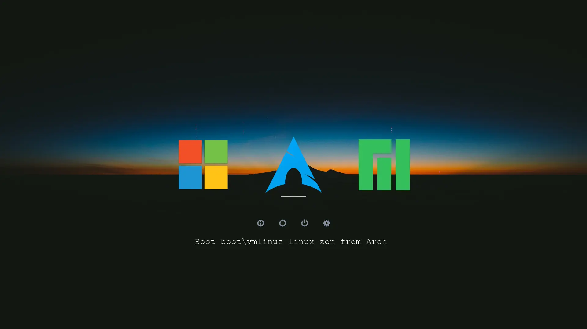 |
| [Refind-theme-Fluent-dark](https://github.com/voduong404/Refind-theme-Fluent-dark) | Fluent Theme for rEFInd | [voduong404](https://github.com/voduong404)  | false |  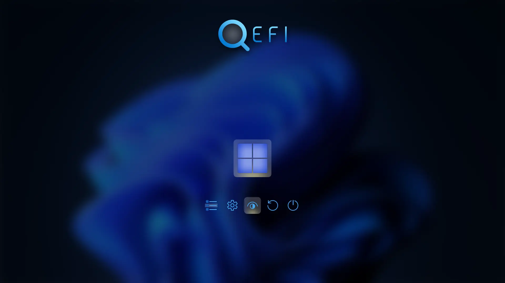 |
| [refind-material-theme](https://github.com/Patricol/refind-material-theme) | Material Theme for rEFInd; with scripts used to generate it. | [Patricol](https://github.com/Patricol)  | false |   |
| [rEFInd-details](https://github.com/AliciaTransmuted/rEFInd-details) | A colourful theme for the rEFInd UEFI boot manager | [AliciaTransmuted](https://github.com/AliciaTransmuted)  | false |   |
| [custom-bootloader](https://github.com/tedski999/custom-bootloader) | My personal bootloader configuration and resource files | [tedski999](https://github.com/tedski999)  | false |  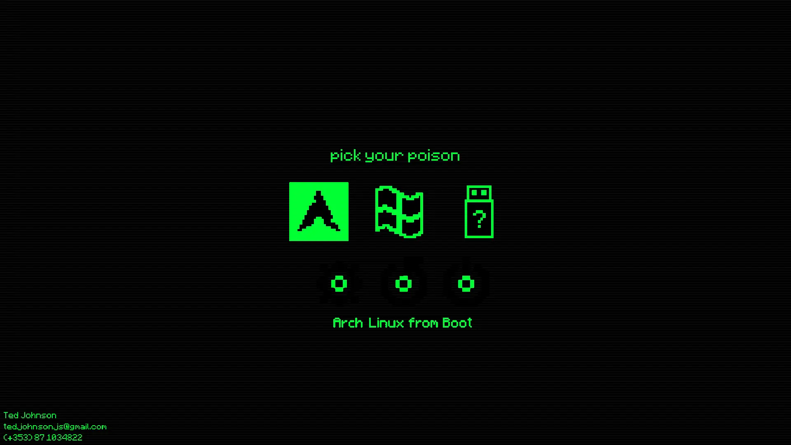 |
| [rEFInd-minimal-dark](https://github.com/PillTime/rEFInd-minimal-dark) | rEFInd is a simplistic boot manager for UEFI based systems. This is a dark, clean, minimal theme for it. | [PillTime](https://github.com/PillTime)  | false |  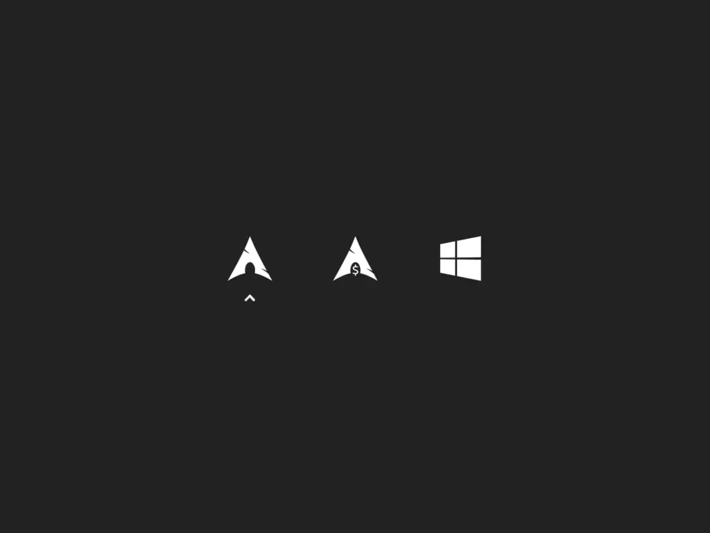 |
| [refind-theme-regular](https://github.com/noraj/refind-theme-regular) | A simplistic clean and minimal theme for rEFInd | [noraj](https://github.com/noraj)  | true |   |
| [rEFInd-theme-Yours](https://github.com/M-L-P/rEFInd-theme-Yours?tab=readme-ov-file) | Y-o-u-r-s, Your own usual rEFInd's sign. You can set your profile, device and your name. Yours is based on rEFInd, with grubfm built-in. | [M-L-P](https://github.com/M-L-P)  | false |   |
| [refind-ambience-deer-and-fireflies](https://github.com/jpmvferreira/refind-ambience-deer-and-fireflies) | A simple and minimalist theme for the rEFInd boot loader | [jpmvferreira](https://github.com/jpmvferreira)  | false |   |
| [refind-gruvbox-theme](https://github.com/sihann/refind-gruvbox-theme) | Theme for rEFInd based on Gruvbox color scheme | [sihann](https://github.com/sihann)  | false |  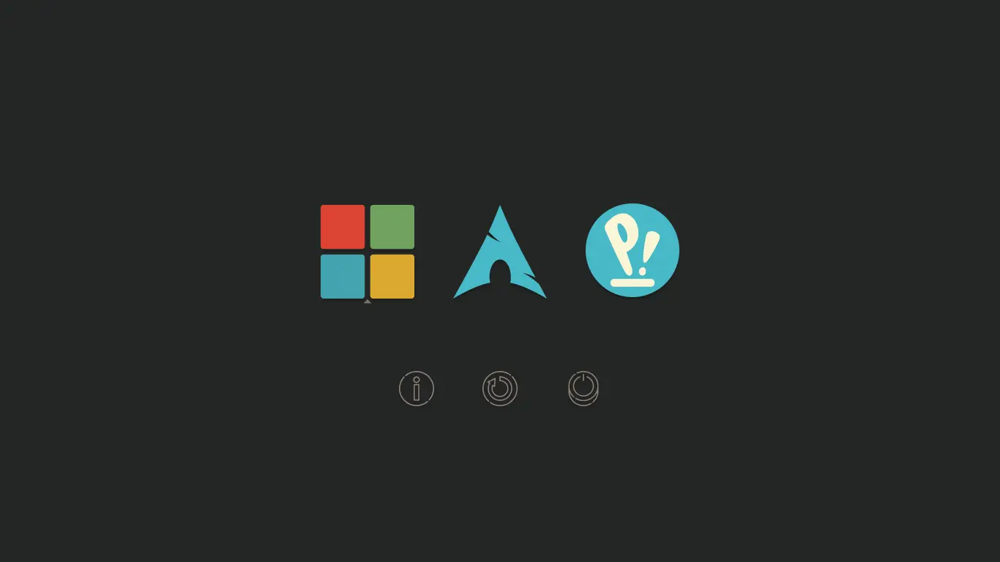 |
| [rEFInd-mountain](https://github.com/Chrisae9/rEFInd-mountain) | A clean mountain theme for the rEFInd UEFI boot manager. | [Chrisae9](https://github.com/Chrisae9)  | false |   |
| [refind-theme-regular](https://github.com/1j01/refind-theme-regular) | A simplistic clean and minimal theme for rEFInd | [1j01](https://github.com/1j01)  | false |   |
| [hi-themes-refind](https://github.com/SLywnow/hi-themes-refind) | Multi-themes for refined | [SLywnow](https://github.com/SLywnow)  | true |   |
| [linux-boot-efi](https://github.com/Valeria-Fadeeva/linux-boot-efi) | rEFInd theme, systemd-boot, mkinitcpio, dracut, plymouth, sddm, wallpapers, color-schemes, nvidia, amdgpu | [Valeria-Fadeeva](https://github.com/Valeria-Fadeeva)  | true |   |
| [grey-apple](https://github.com/matomatical/grey-apple) | rEFInd theme inspired by apple boot screen | [matomatical](https://github.com/matomatical)  | false |   |
| [LazaGRUB](https://github.com/FerLS/LazaGRUB) | Una GRUB hecha en rEFInd basada en Lazaro©™ | [FerLS](https://github.com/FerLS)  | false |   |
| [rEFInd-dawn](https://github.com/ajlende/rEFInd-dawn) | A rEFInd theme | [ajlende](https://github.com/ajlende)  | false |   |
| [rEFInd-pachirisu](https://github.com/zeroday0619/rEFInd-pachirisu) | Pachirisu theme for the rEFInd boot manager | [zeroday0619](https://github.com/zeroday0619)  | false |   |
| [rEFInd-Celestial-Theme](https://github.com/Paradox1937/rEFInd-Celestial-Theme) | A modern, colorful Theme for the rEFInd Bootmanager (Theme by Paradox1937) | [Paradox1937](https://github.com/Paradox1937)  | false |   |
| [terminal-bootloader](https://github.com/phonot/terminal-bootloader) | my personal bootloader theme | [phonot](https://github.com/phonot)  | false |   |
| [rEFInd-RetroGame](https://github.com/riftsandroses/rEFInd-RetroGame) | A Retro Game inspired theme for rEFInd Boot Manager. This theme will surely make you reminisce about the yesteryears of Retro Gaming and Pixelated Sprite graphics. | [riftsandroses](https://github.com/riftsandroses)  | false |   |
| [BlackCatMuzzle-rEFInd](https://github.com/Scorpi-ON/BlackCatMuzzle-rEFInd) | rEFInd is a simplistic boot manager for UEFI-based systems. This is a clean, dark and cute theme for it. | [Scorpi-ON](https://github.com/Scorpi-ON)  | true |  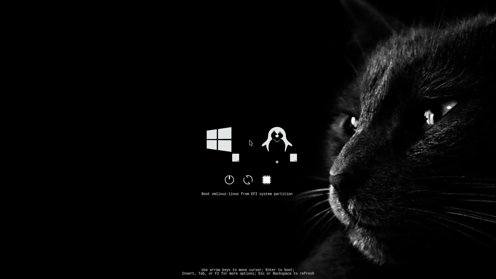 |
| [rEFInd-wildside](https://github.com/AliciaTransmuted/rEFInd-wildside) | rEFInd-wildside is a shiny black background with bold red 3d icon theme for the rEFInd UEFI Boot Manager. | [AliciaTransmuted](https://github.com/AliciaTransmuted)  | false |  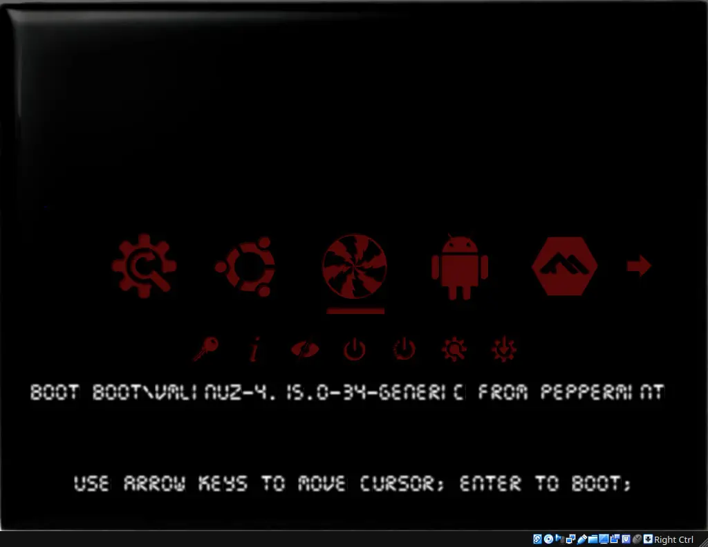 |
| [rEFInd-splash](https://github.com/AliciaTransmuted/rEFInd-splash) | rEFInd-splash is a swimming pool theme with colourful pool toy icons for the rEFInd UEFI Boot Manager | [AliciaTransmuted](https://github.com/AliciaTransmuted)  | false |   |
| [hi-dark](https://github.com/SLywnow/hi-dark) | A little test dark theme, based on https://github.com/dheishman/refind-dreary | [SLywnow](https://github.com/SLywnow)  | false |   |
| [refind-theme-regular-minimalism](https://github.com/Gutleibmann/refind-theme-regular-minimalism) | Another yet theme for rEFInd boot manager | [Gutleibmann](https://github.com/Gutleibmann)  | false |  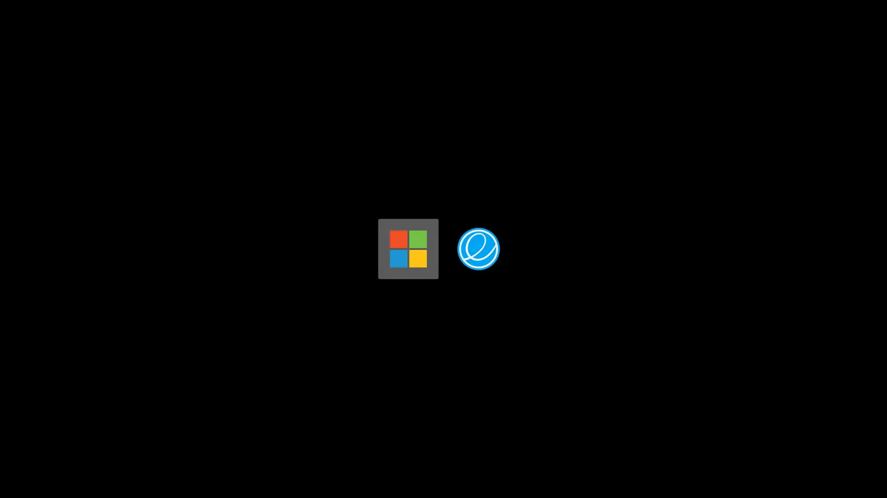 |
| [rEFInd-Metro](https://github.com/BetaTester41/rEFInd-Metro) | rEFInd is a simplistic boot manager for UEFI based systems. This is a clean and minimal theme for it. | [BetaTester41](https://github.com/BetaTester41)  | false |  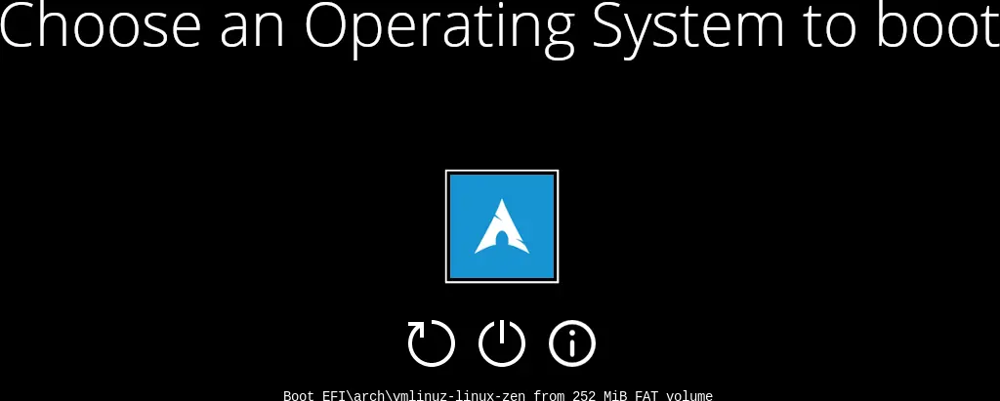 |
| [rEFInd-Phi](https://github.com/zwzheng45/rEFInd-Phi) | rEFInd Phigros主题 | [zwzheng45](https://github.com/zwzheng45)  | false |   |
| [rEFInd-Minimalist](https://github.com/Nyoutaaa/rEFInd-Minimalist) | A rEFInd-Minimalist for rEFInd. | [Nyoutaaa](https://github.com/Nyoutaaa)  | false |   |

## 🧞 Commands

All commands are run from the root of the project, from a terminal:

| Command                   | Action                                           |
| :------------------------ | :----------------------------------------------- |
| `pnpm install`             | Installs dependencies                            |
| `pnpm run dev`             | Starts local dev server at `localhost:4321`      |
| `pnpm run build`           | Build your production site to `./dist/`          |
| `pnpm run preview`         | Preview your build locally, before deploying     |
| `pnpm run astro ...`       | Run CLI commands like `astro add`, `astro check` |
| `pnpm run astro -- --help` | Get help using the Astro CLI                     |

